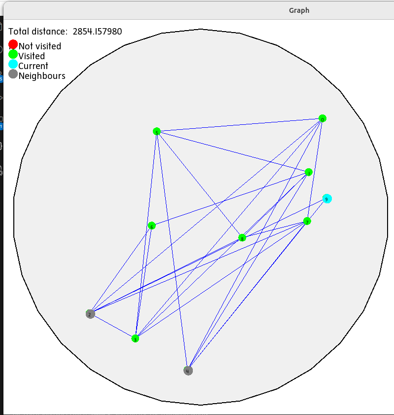

## TSP MadDevs

- На линукс:
1) скачать SFLM:   
`sudo apt-get install libsfml-dev`

2) Может еще что то докачать, не помню

3) Запустить: `make`
---

- На Windows я не смог скачать SFLM - картинки у меня нет. Поэтому в makefile изменить строчки на:

1) `FILES = graph.cc  main.cc  solution.cc #window.cc `

2) `SFML = #-lsfml-graphics -lsfml-window -lsfml-system`

- в header.h:

1) `//#include <SFML/Graphics.hpp>`

---
## Входные данные

В `main.cc` радиус `radius` считается в пикселях и должен быть меньше `window_size`:

**radius < window_size/2**

`price` - роли не играет, так как считалась только длина маршрута в пикселях

В `path` находится путь из `start` в `end`.

Некоторые точки выходят за границы круга. почему? честно не представляю, возможно из-за функции рандома или архитектуры системы

