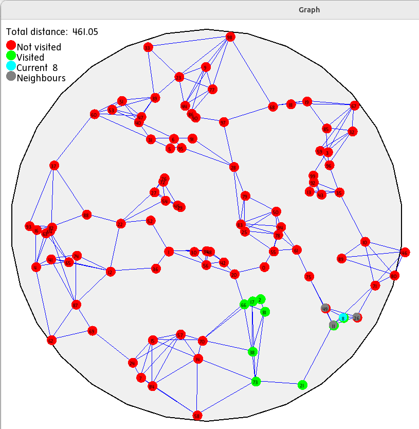

## О проекте
 
Этот проект представляет собой реализацию задачи коммивояжера (Traveling Salesman Problem, TSP) на языке C++. Задача коммивояжера заключается в нахождении кратчайшего возможного маршрута, который проходит через заданный набор городов и возвращается в исходный город.

## Требования

Для работы проекта необходимы следующие компоненты:
- Компилятор C++
- Библиотека SFML для графического отображения (Simple and Fast Multimedia Library)
- Система сборки `make` для Linux или `vcpkg` для Windows

Проект визуализирует решение задачи коммивояжера, отображая города и маршруты на экране.

## About the Project

This project is an implementation of the Traveling Salesman Problem (TSP) in C++. The TSP is a classic algorithmic problem in the fields of computer science and operations research. It focuses on finding the shortest possible route that visits a given set of cities and returns to the origin city.

## Requirements

To run this project, you will need the following components:
- A C++ compiler
- The SFML library for graphical display (Simple and Fast Multimedia Library)
- The `make` build system for Linux or `vcpkg` for Windows

The project visualizes the solution to the TSP by displaying cities and routes on the screen.

## Algorithms Used

The project uses the following algorithms to solve the TSP:
- **Nearest Neighbor Algorithm**: A heuristic algorithm that builds a path by repeatedly visiting the nearest unvisited city.
- **Genetic Algorithm**: An optimization algorithm inspired by the process of natural selection, used to find approximate solutions to the TSP.
- **Simulated Annealing**: A probabilistic technique for approximating the global optimum of a given function, used to improve the TSP solution.

These algorithms help in finding efficient routes for the TSP and visualizing the results effectively.

# Installation and launching

### On Linux:
1) Download SFML:   
`sudo apt-get install libsfml-dev`

2) Additional dependencies may be required

3) Run: `make`
---
### На линукс:
1) скачать SFLM:   
`sudo apt-get install libsfml-dev`

2) Может еще что то докачать, не помню

3) Запустить: `make`
---

### On Windows | На Windows 

### Install SFML on Windows using vcpkg
    1) `git clone https://github.com/microsoft/vcpkg.git`
    2) `cd vcpkg; .\bootstrap-vcpkg.bat`
    3) Add the `vcpkg.exe` location to the Path
    4) `vcpkg install sfml`

---

## Input Data

In `main.cc`, the radius `radius` is measured in pixels and should be less than `window_size`:

**radius < window_size/2**

`price` does not matter, as only the route length in pixels was considered.

The `path` contains the route from `start` to `end`.

Some points go beyond the circle boundaries - a display issue, according to the coordinates they fall within the circle of the given radius.

## Входные данные

В `main.cc` радиус `radius` считается в пикселях и должен быть меньше `window_size`:

**radius < window_size/2**

`price` - роли не играет, так как считалась только длина маршрута в пикселях

В `path` находится путь из `start` в `end`.

Некоторые точки выходят за границы круга - проблема отображения, согласно координатам они входят в окружность заданного радиуса

